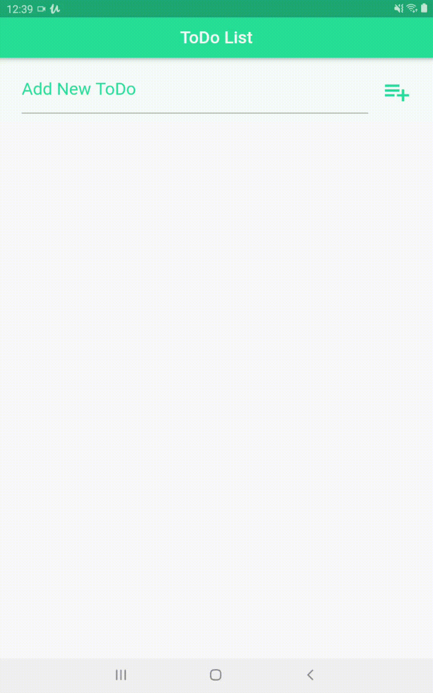

 <p align="center">
      
   </p>

   <h1 align="center">ToDo</h1>

   <h2 align="center">Topics 📋</h2>

   <p>
   
   - [About 📖](#about-)
   - [Preview 📱](#preview-)
   - [Challenges and Learnings along the way 🤯](#---challenges-and-learnings-along-the-way----)
   - [How to Use 🤔](#how-to-use-)
   - [How to Contribute 💪](#how-to-contribute-)
   - [License 📝](#license-)

   </p>

   <h2 align="center">About 📖</h2>
   
   <p align="center">   
      A simple ToDo app made with Flutter 💙.<br>
      With this app you can make your ToDos and organize them. You can add them, delete them (with option to undo later), and view them so that you see the ones that are pending first, and below the completed ones. It is a simple application, but it can be very useful when it comes to your organization. 😃
      This application is in version 1.1.
   </p>

---

   <h2 align="center">Preview 📱</h2><br>

   <p align="center">
   
   </p>

   > * You can see all version previews in [`demos`](https://github.com/felipecastrosales/ToDo/tree/master/demos) folder. 🧐📂

---

 <h2 align="center">
   Challenges and Learnings along the way 🤯
   </h2>

   This application was very simple and so was the development, but it also, due to the layout, forced me to consult documentation, articles and forums (StackOverFlow, GitHub Issues and others) several times, which made me learn even more 🤯. Foturnately, I managed to make the application more beautiful, and I intend  to make more updates in future.

---

   <h2 align="center">How to Use 🤔</h2>

   ```   
   - Clone this repository:
   $ git clone https://github.com/felipecastrosales/ToDo ToDo

   - Enter in directory:
   $ cd ToDo

   - For install dependencies:
   $ flutter packages get

   - Run the app: 
   $ flutter run
   ```

---

<h2 align="center">How to Contribute 💪</h2>

   ```
   - Fork the project 

   - Create a new branch with your changes:
   $ git checkout -b my-feature

   - Save your changes and create a commit message telling you what you did:
   $ git commit -m "feature: My new feature"

   - Submit your changes:
   $ git push origin my-feature
   ```

---

   <h2 align="center">License 📝</h2>

   This repository is under MIT license. You can see the [LICENSE](https://github.com/felipecastrosales/ToDo/blob/master/LICENSE) file for more details. 😉

   ---

   >This project was developed with ❤️ by **[@Felipe Sales](https://www.linkedin.com/in/felipecastrosales/)**, with the instructor **[Daniel Ciolfi](https://linkedin.com/in/danielciolfi)**, in the course  **["Creating Android and iOS Apps with Flutter - Create 16 Apps"](https://www.udemy.com/course/curso-completo-flutter-app-android-ios)** on **[Udemy](https://www.udemy.com/)**.<br>
   If it helped you, give ⭐, contribute, it will help me too 😉

---

   <div align="center">

   [](https://www.linkedin.com/in/felipecastrosales/)

   </div>
